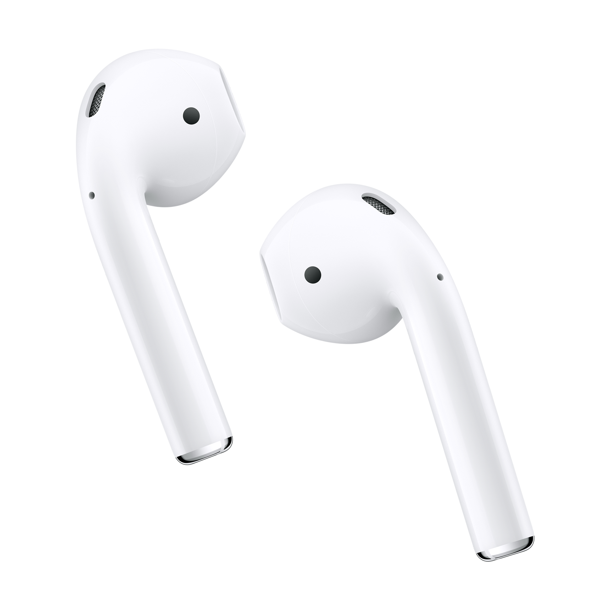

# Connect AirPods

[Original post by Josh Johnson](https://medium.com/@secondfret/how-to-connect-your-airpods-to-your-mac-with-a-keyboard-shortcut-9d72e786993b). All credit goes to the author. These are just the steps for my personal use and to remember how to do it in the future. AirPods image from Apple Inc.

### Install

1.  Edit `Your AirPods ID` inside `Connect AirPods.scpt`
2.  Save as Application using Apple's Script Editor
3.  Move the resulting `Connect AirPods.app` to `/Applications`
4.  Allow the application control from `System Preferences > Security & Privacy > Privacy > Accesibility`
5.  Install `Connect AirPods.alfredworkflow`
6.  Type `airpods` to connect your AirPods
